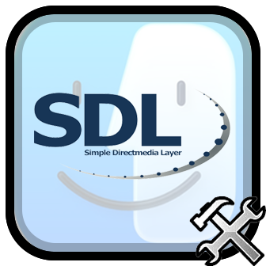

	

# SDL Mod

Evil mod that replaces the windowing backend on macOS with SDL. For some reason, this fixes a lot of issues, including:

- Improved frame pacing (significant framerate increase)
- Improved resolution on Retina devices
- Fixed display cutout issues in fullscreen
- Slightly more accurate colors
- (Partial) Controller support

The mod settings also has options like FPS bypass and free resize.

---

The [SDL](https://github.com/libsdl-org/SDL) logo or Finder logo shown in the mod logo are not mine.
